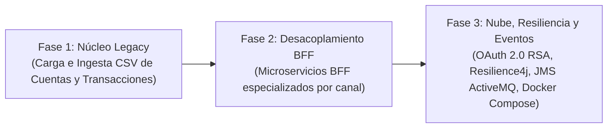
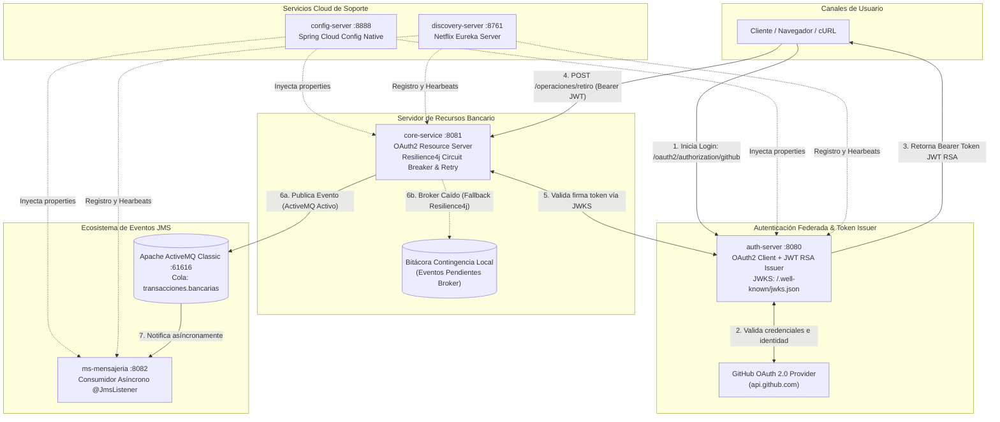
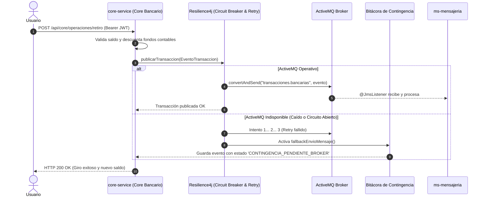

# PROPUESTA TÉCNICA DE ARQUITECTURA DISTRIBUIDA
## Sistema Bancario Cloud Resiliente, Mensajería Asíncrona JMS y Seguridad OAuth 2.0 / JWT RSA
### Banco XYZ — Experiencia 3: Semana 8

---

* **Asignatura:** Desarrollo Backend III (PBY2203)
* **Profesor:** Marcelo Zepeda  
* **Estudiantes:** Leonardo Bustamante - Carolina Delgado  
* **Institución:** Duoc UC  
* **Fecha:** Octubre 2026  

---

## 1. Resumen Ejecutivo

La presente propuesta técnica detalla el diseño, evolución e implementación de la arquitectura distribuida del **Banco XYZ**, orientada a soportar operaciones financieras críticas en entornos de nube (Cloud Native). La solución moderniza la plataforma bancaria incorporando:
1. **Seguridad Federada y Descentralizada:** Autenticación de usuarios vía **OAuth 2.0** delegada en GitHub, emisión de tokens de acceso **JWT con firma asimétrica RSA (RS256)** y verificación mediante endpoint público **JWKS (`/.well-known/jwks.json`)** en el Servidor de Recursos (`core-service`).
2. **Tolerancia a Fallos y Alta Disponibilidad:** Patrones **Circuit Breaker** y **Retry** mediante **Resilience4j**, garantizando que una indisponibilidad o degradación del broker de mensajería no interrumpa las operaciones contables (retiros y transferencias), activando una bitácora de contingencia local.
3. **Arquitectura Orientada a Eventos Asíncronos:** Comunicación asíncrona punto a punto mediante **JMS (Java Message Service)** y el broker **Apache ActiveMQ Classic**, con total desacoplamiento entre el emisor transaccional (`core-service`) y el procesador de notificaciones (`ms-mensajeria`).
4. **Infraestructura Cloud, Contenerización y Orquestación:** Configuración centralizada distribuida con **Spring Cloud Config Server**, descubrimiento dinámico mediante **Netflix Eureka** con seguridad Basic Auth, contenerización modular con **Docker (Eclipse Temurin JDK 21 Alpine)** y orquestación unificada mediante **Docker Compose** sobre una red privada aislada (`banco-net`).

---

## 2. Contexto Histórico y Evolución Arquitectónica

El sistema bancario ha transitado por tres fases evolutivas progresivas:

### Fase 1: Núcleo de Datos Legacy
El origen del proyecto radicó en procesar y persistir la información financiera histórica provista en el repositorio base [`bank_legacy_data`](https://github.com/KariVillagran/bank_legacy_data). Se modelaron las entidades `Cuenta`, `Transaccion` y `MovimientoAnual`, y se implementó un cargador (`CargadorDatosLegacy`) para inicializar 50 cuentas bancarias, sus movimientos históricos e intereses a partir de archivos planos CSV estructurados (`cuentas_anuales.csv`, `intereses.csv`, `transacciones.csv`).

### Fase 2: Desacoplamiento mediante Backend for Frontend (BFF)
Posteriormente, la arquitectura integró capas BFF para canal web y móvil, adaptando las respuestas bancarias según la experiencia del usuario. Estos microservicios BFF residen de forma desacoplada y modular como componentes satélites, manteniendo la independencia del núcleo transaccional.

### Fase 3: Arquitectura Cloud Resiliente, Eventos y Seguridad Federada 
Para la presente entrega sumativa, el foco estratégico se centró en dotar a la plataforma de robustez Cloud empresarial:
* Se separó el sistema en microservicios independientes listos para contenedores.
* Se incorporó el Servidor de Configuración Centralizada (`config-server`) y el Servidor de Descubrimiento (`discovery-server`).
* Se implementó el protocolo de autorización **OAuth 2.0** con proveedor externo de identidad (GitHub) y emisión de **JWT RSA** en `auth-server`.
* Se blindó el núcleo bancario (`core-service`) transformándolo en un **Resource Server** protegido.
* Se adoptó **JMS sobre Apache ActiveMQ** para mensajería transaccional asíncrona.
* Se integró un consumidor dedicado (`ms-mensajeria`) con `@JmsListener`.
* Se implementó tolerancia a fallos con **Resilience4j** aislando fallos de transporte.
* Se dockerizó la totalidad de los servicios y se orquestaron en `docker-compose.yml`.

---

## 3. Justificación de Decisiones Tecnológicas

| Criterio / Decisión | Tecnología Seleccionada | Justificación Técnica y Beneficio Operativo |
| :--- | :--- | :--- |
| **Mensajería Asíncrona** | **JMS + Apache ActiveMQ Classic** | Para esta entrega se requirió explícitamente evitar Apache Kafka. JMS es el estándar empresarial Java de mayor madurez para mensajería punto a punto (Queue). ActiveMQ Classic proporciona colas persistentes fiables (`transacciones.bancarias`), consola administrativa ligera y bajo consumo de recursos en despliegues contenerizados frente al peso de brokers basados en clústeres Zookeeper/KRaft. |
| **Seguridad de Autenticación** | **OAuth 2.0 Federado (GitHub)** | Delegar la autenticación de usuarios en un proveedor de identidad de clase mundial (Identity Provider - IdP) como GitHub elimina la necesidad de almacenar contraseñas en bases de datos locales, mitigando riesgos de fugas de credenciales y cumpliendo estándares OWASP. |
| **Emisión y Validación de Tokens** | **JWT con Criptografía Asimétrica RSA (RS256) + JWKS** | A diferencia de los secretos simétricos (HMAC-SHA256) donde todos los microservicios deben compartir la misma clave secreta (vulnerable si un servicio se ve comprometido), RSA utiliza un par de claves: `auth-server` posee la clave privada para firmar, y expone la clave pública vía JWKS (`/.well-known/jwks.json`). Los Resource Servers verifican la autenticidad del token localmente sin sobrecargar la red ni compartir secretos. |
| **Tolerancia a Fallos** | **Resilience4j Circuit Breaker + Retry** | En una arquitectura orientada a eventos, la caída temporal del broker no debe bajo ninguna circunstancia bloquear ni hacer fallar una operación financiera del usuario (giro o transferencia). El Circuit Breaker aísla el fallo tras superar la tasa umbral (50%), aplica hasta 3 reintentos escalonados, y desvía los eventos hacia un Fallback de contingencia en memoria sin generar error HTTP 500 al cliente. |
| **Configuración Distribuida** | **Spring Cloud Config Server (Native Profile)** | Permite centralizar la parametrización de puertos, rutas, brokers y credenciales en una única fuente de verdad (`config-repo`). Ante cambios de infraestructura, los microservicios sincronizan sus propiedades sin requerir recompilación de código. |
| **Contenerización y Redes** | **Docker + Docker Compose (banco-net)** | Empaqueta cada servicio con una JVM mínima optimizada (`eclipse-temurin:21-jdk-alpine`), asegurando idéntico comportamiento en desarrollo, pruebas y producción Cloud. La red interna privada bridge `banco-net` impide accesos no autorizados a servicios internos como ActiveMQ o Config Server. |

---

## 4. Diagrama de Arquitectura de la Solución

---

## 5. Especificación de Componentes y Matriz de Puertos

| Microservicio / Contenedor | Puerto Host | Protocolo / Rol | Seguridad / Acceso |
| :--- | :---: | :--- | :--- |
| **`config-server`** | `8888` | HTTP REST / Servidor central de configuraciones | HTTP Basic Auth (`admin` / `gato`) |
| **`discovery-server`** | `8761` | HTTP Web / Eureka Service Registry | HTTP Basic Auth (`admin` o `eureka` / `eureka2026`) |
| **`auth-server`** | `8080` | HTTP REST / Servidor de Autorización OAuth 2.0 y JWKS | OAuth2 Client GitHub + RSA 2048-bit |
| **`core-service`** | `8081` | HTTP REST / Servidor de Recursos de Operaciones Bancarias | OAuth2 Resource Server (Bearer JWT obligatorio) |
| **`ms-mensajeria`** | `8082` | HTTP REST + JMS / Consumidor Asíncrono de Eventos | Interno en red Docker / Actuator público |
| **`activemq`** | `61616` / `8161` | TCP OpenWire (61616) / Consola Web Admin (8161) | Credenciales broker (`admin` / `admin`) |

---

## 6. Mecanismos de Tolerancia a Fallos (Resilience4j)

La publicación de eventos en `core-service` implementa una estrategia de defensa en profundidad ante contingencias de red o saturación de ActiveMQ:

### Parámetros Operativos del Circuit Breaker (`envioMensajeria`)
* **`slidingWindowSize` = 10:** Evalúa las últimas 10 invocaciones para determinar la salud del enlace.
* **`failureRateThreshold` = 50%:** Si el 50% o más de las llamadas fallan, el circuito pasa al estado **OPEN**.
* **`waitDurationInOpenState` = 10000ms (10 segundos):** Período de enfriamiento antes de pasar a **HALF_OPEN**.
* **`permittedNumberOfCallsInHalfOpenState` = 3:** Permite 3 llamadas de prueba en estado semi-abierto para verificar si el broker restableció la conectividad.
* **`maxAttempts` = 3:** Política de reintentos escalonados antes de activar el fallback.

---

## 7. Estrategia de Contenerización y Despliegue Cloud

1. **Imágenes Ligeras y Seguras:**
   Se utiliza como imagen base `eclipse-temurin:21-jdk-alpine`, la cual minimiza la superficie de ataque, reduce el tamaño de descarga por debajo de los 250 MB por microservicio y optimiza el tiempo de inicio de la JVM.
2. **Aislamiento de Red:**
   Todos los contenedores se comunican a través de la red privada tipo bridge `banco-net`. Solo los puertos estrictamente necesarios se mapean hacia el host de desarrollo o balanceador de carga.
3. **Gestión de Secretos según 12-Factor App:**
   El secreto del cliente OAuth de GitHub (`GITHUB_CLIENT_SECRET`) nunca se almacena en el código fuente. Se inyecta en tiempo de ejecución a través de variables de entorno administradas en `.env` (excluido de Git mediante `.gitignore`), complementado con la plantilla pública `.env.example`.

---

## 8. Conclusión

La arquitectura implementada para el **Banco XYZ** cumple estrictamente con los objetivos de la Semana 8. Demuestra una transición exitosa desde un modelo monolítico basado en datos legacy hacia un ecosistema distribuido moderno: seguro mediante estándares abiertos (OAuth 2.0 y JWT RSA), desacoplado mediante eventos asíncronos (JMS ActiveMQ), tolerante a caídas de infraestructura (Resilience4j) y 100% orquestado para la nube con Docker Compose.
